# ArcRouter Style Collection

메이플풍 아바타부터 픽셀, 캐릭터 카드, 수채, 콜라주, 포스터까지 확장하는 **이미지 스타일 컬렉션 + 에이전트 스킬**입니다. 손그림에 한정하지 않습니다.

[ArcRouter 홈페이지](https://arcrouter.dev) · [ArcRouter 스타일 갤러리](https://arcrouter.dev/skills/handraw-style#visual-gallery) · [스타일 목록](references/styles.json) · [에이전트 스킬](SKILL.md)


## 번호 대응표 · Style index

번호를 고르면 아래 그림체입니다. 이름을 누르지 않아도 `AR049`처럼 번호만 에이전트에 전달하면 됩니다. 전체 정보는 [references/styles.json](references/styles.json)에 있습니다.

Every ID and the image it stands for. Pass the ID alone (e.g. `AR049`) to your agent; full metadata lives in [references/styles.json](references/styles.json).

### 추천 · Featured

<table><tr>
<td align="center" width="25%">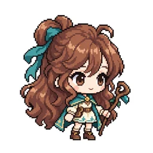<br><b>MAPLE01</b><br>메이플스토리풍 아바타<br><sub>MapleStory-like avatar</sub></td>
</tr></table>

### 잉크 · Ink (AR001–AR012)

<table>
<tr><td align="center" width="25%">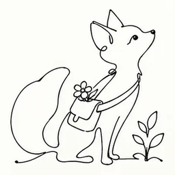<br><b>AR001</b><br>한 줄 인물<br><sub>Single-line figure</sub></td><td align="center" width="25%">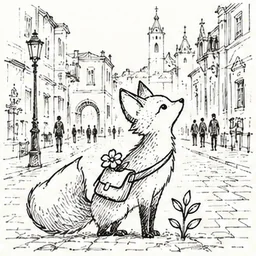<br><b>AR002</b><br>가는 도시 선<br><sub>Fine city lines</sub></td><td align="center" width="25%">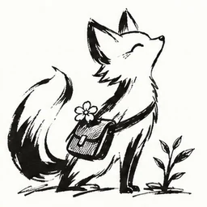<br><b>AR003</b><br>붓펜 몸짓<br><sub>Brush-pen gestures</sub></td><td align="center" width="25%">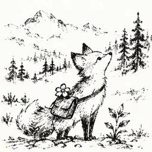<br><b>AR004</b><br>마른 먹 풍경<br><sub>Dry-ink landscape</sub></td></tr>
<tr><td align="center" width="25%">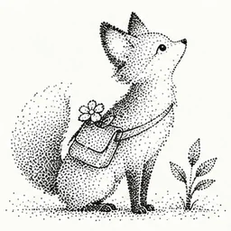<br><b>AR005</b><br>점묘 잉크<br><sub>Stippled ink</sub></td><td align="center" width="25%">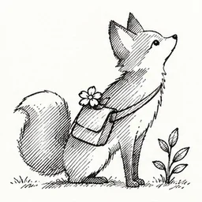<br><b>AR006</b><br>평행 해칭<br><sub>Parallel hatching</sub></td><td align="center" width="25%">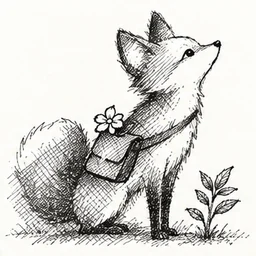<br><b>AR007</b><br>교차 펜 음영<br><sub>Crosshatched pen</sub></td><td align="center" width="25%"><br><b>AR008</b><br>검은 실루엣<br><sub>Black silhouettes</sub></td></tr>
<tr><td align="center" width="25%">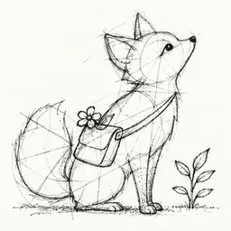<br><b>AR009</b><br>관찰 노트<br><sub>Observation notebook</sub></td><td align="center" width="25%">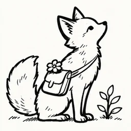<br><b>AR010</b><br>굵은 외곽선<br><sub>Bold contour</sub></td><td align="center" width="25%">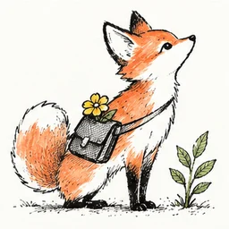<br><b>AR011</b><br>잉크와 한 색<br><sub>Ink plus one color</sub></td><td align="center" width="25%"><br><b>AR012</b><br>빈 공간 드로잉<br><sub>Open-space drawing</sub></td></tr>
</table>

### 연필 · Pencil (AR013–AR024)

<table>
<tr><td align="center" width="25%"><br><b>AR013</b><br>흑연 형태 연구<br><sub>Graphite form study</sub></td><td align="center" width="25%">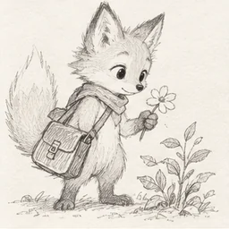<br><b>AR014</b><br>가는 연필 인물<br><sub>Fine pencil figures</sub></td><td align="center" width="25%">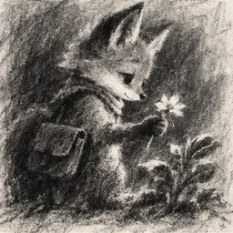<br><b>AR015</b><br>거친 목탄<br><sub>Rough charcoal</sub></td><td align="center" width="25%">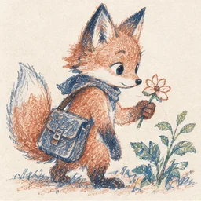<br><b>AR016</b><br>두 색 연필<br><sub>Two-pencil palette</sub></td></tr>
<tr><td align="center" width="25%">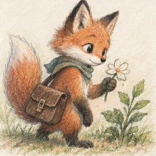<br><b>AR017</b><br>겹친 색연필<br><sub>Layered colored pencil</sub></td><td align="center" width="25%">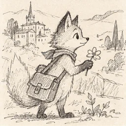<br><b>AR018</b><br>여행 연필 메모<br><sub>Travel pencil notes</sub></td><td align="center" width="25%">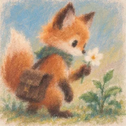<br><b>AR019</b><br>부드러운 파스텔<br><sub>Soft pastel blocks</sub></td><td align="center" width="25%">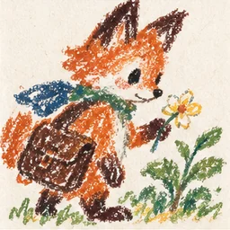<br><b>AR020</b><br>굵은 크레용<br><sub>Thick crayon marks</sub></td></tr>
<tr><td align="center" width="25%">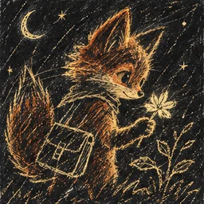<br><b>AR021</b><br>긁어낸 크레용<br><sub>Scratched crayon</sub></td><td align="center" width="25%"><br><b>AR022</b><br>노트 여백 낙서<br><sub>Margin doodles</sub></td><td align="center" width="25%">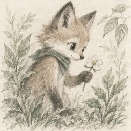<br><b>AR023</b><br>옅은 색연필 자연화<br><sub>Pale pencil nature</sub></td><td align="center" width="25%">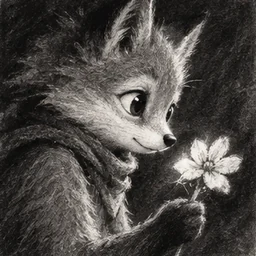<br><b>AR024</b><br>고대비 목탄 초상<br><sub>High-contrast charcoal portrait</sub></td></tr>
</table>

### 수채 · Watercolor (AR025–AR036)

<table>
<tr><td align="center" width="25%">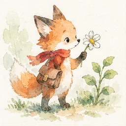<br><b>AR025</b><br>옅은 수채 담채<br><sub>Light watercolor wash</sub></td><td align="center" width="25%">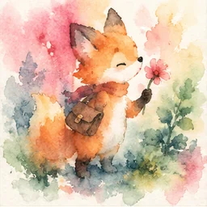<br><b>AR026</b><br>젖은 번짐<br><sub>Wet color blooms</sub></td><td align="center" width="25%">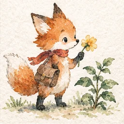<br><b>AR027</b><br>건조한 수채 경계<br><sub>Dry watercolor edges</sub></td><td align="center" width="25%">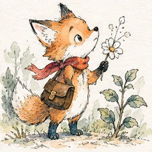<br><b>AR028</b><br>수채와 먹선<br><sub>Watercolor with ink</sub></td></tr>
<tr><td align="center" width="25%">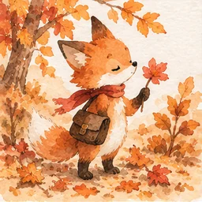<br><b>AR029</b><br>계절 풍경 수채<br><sub>Seasonal watercolor</sub></td><td align="center" width="25%">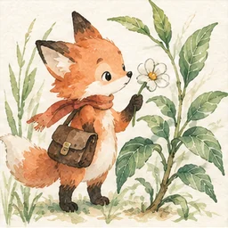<br><b>AR030</b><br>식물 관찰 수채<br><sub>Botanical watercolor</sub></td><td align="center" width="25%">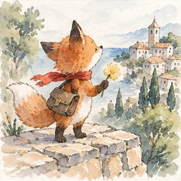<br><b>AR031</b><br>여행 수채 기록<br><sub>Travel watercolor journal</sub></td><td align="center" width="25%">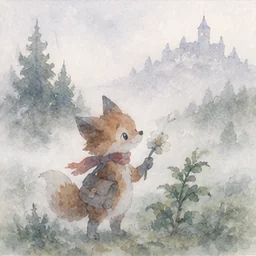<br><b>AR032</b><br>안개빛 풍경<br><sub>Misty washes</sub></td></tr>
<tr><td align="center" width="25%">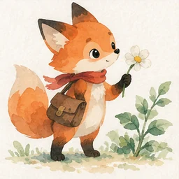<br><b>AR033</b><br>맑은 인물 담채<br><sub>Clear figure washes</sub></td><td align="center" width="25%">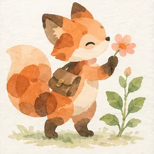<br><b>AR034</b><br>수채 얼룩 동물<br><sub>Watercolor animal shapes</sub></td><td align="center" width="25%">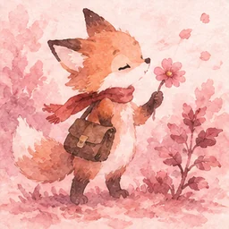<br><b>AR035</b><br>분홍빛 번짐<br><sub>Rose-tinted washes</sub></td><td align="center" width="25%">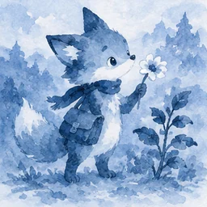<br><b>AR036</b><br>청색 단색 수채<br><sub>Blue monochrome wash</sub></td></tr>
</table>

### 물감 · Paint (AR037–AR048)

<table>
<tr><td align="center" width="25%"><br><b>AR037</b><br>불투명 과슈<br><sub>Opaque gouache</sub></td><td align="center" width="25%">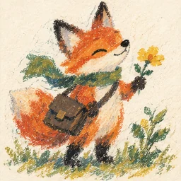<br><b>AR038</b><br>오일파스텔 덩어리<br><sub>Oil-pastel masses</sub></td><td align="center" width="25%"><br><b>AR039</b><br>포스터 물감<br><sub>Poster-paint shapes</sub></td><td align="center" width="25%">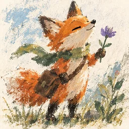<br><b>AR040</b><br>마른 붓 색면<br><sub>Dry-brush color</sub></td></tr>
<tr><td align="center" width="25%">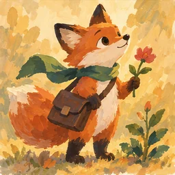<br><b>AR041</b><br>따뜻한 과슈 동화<br><sub>Warm gouache tales</sub></td><td align="center" width="25%">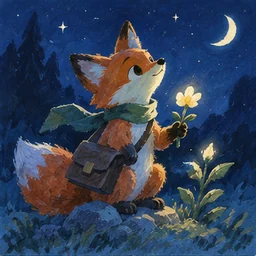<br><b>AR042</b><br>차가운 과슈 밤<br><sub>Cool gouache night</sub></td><td align="center" width="25%"><br><b>AR043</b><br>평면 아크릴<br><sub>Flat acrylic drawing</sub></td><td align="center" width="25%">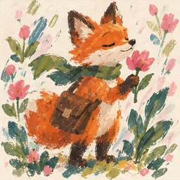<br><b>AR044</b><br>붓질 꽃무늬<br><sub>Brushstroke florals</sub></td></tr>
<tr><td align="center" width="25%">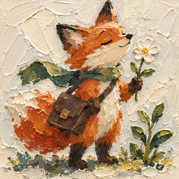<br><b>AR045</b><br>두꺼운 물감 질감<br><sub>Thick paint texture</sub></td><td align="center" width="25%">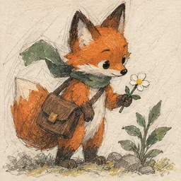<br><b>AR046</b><br>과슈와 연필<br><sub>Gouache with pencil</sub></td><td align="center" width="25%">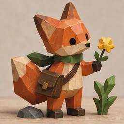<br><b>AR047</b><br>채색 목재 인형<br><sub>Painted wooden figures</sub></td><td align="center" width="25%">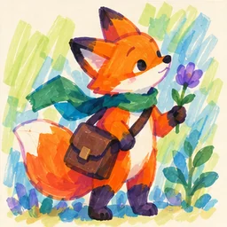<br><b>AR048</b><br>마커 색 겹침<br><sub>Overlapping marker color</sub></td></tr>
</table>

### 판화 · Printmaking (AR049–AR060)

<table>
<tr><td align="center" width="25%">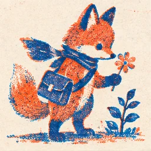<br><b>AR049</b><br>두 색 리소<br><sub>Two-ink riso</sub></td><td align="center" width="25%"><br><b>AR050</b><br>세 색 스크린<br><sub>Three-color screenprint</sub></td><td align="center" width="25%">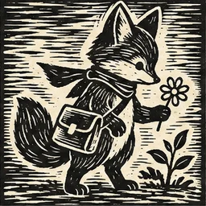<br><b>AR051</b><br>리놀륨 판화<br><sub>Linocut marks</sub></td><td align="center" width="25%">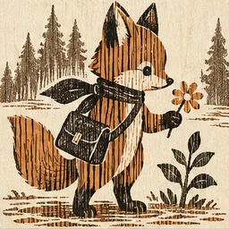<br><b>AR052</b><br>나뭇결 판화<br><sub>Woodgrain print</sub></td></tr>
<tr><td align="center" width="25%">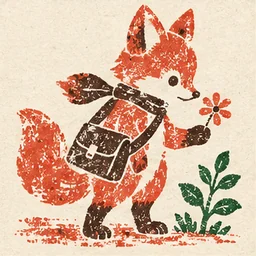<br><b>AR053</b><br>고무도장 그림<br><sub>Rubber-stamp drawing</sub></td><td align="center" width="25%">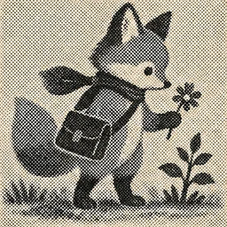<br><b>AR054</b><br>신문 망점<br><sub>Newsprint halftone</sub></td><td align="center" width="25%">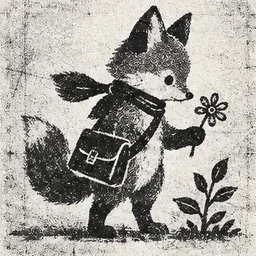<br><b>AR055</b><br>복사기 진<br><sub>Photocopied zine</sub></td><td align="center" width="25%">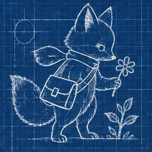<br><b>AR056</b><br>청사진 실루엣<br><sub>Blueprint silhouettes</sub></td></tr>
<tr><td align="center" width="25%">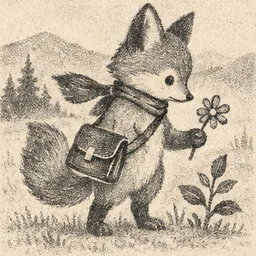<br><b>AR057</b><br>석판화 선<br><sub>Lithographic lines</sub></td><td align="center" width="25%"><br><b>AR058</b><br>단색 목판 이야기<br><sub>Monochrome woodcut tales</sub></td><td align="center" width="25%"><br><b>AR059</b><br>빈티지 별색 포스터<br><sub>Vintage spot-color poster</sub></td><td align="center" width="25%"><br><b>AR060</b><br>모노프린트 얼룩<br><sub>Monoprint textures</sub></td></tr>
</table>

### 콜라주·종이 · Collage & paper (AR061–AR072)

<table>
<tr><td align="center" width="25%"><br><b>AR061</b><br>찢은 종이 풍경<br><sub>Torn-paper landscape</sub></td><td align="center" width="25%"><br><b>AR062</b><br>정밀 종이 오리기<br><sub>Precise paper cutouts</sub></td><td align="center" width="25%"><br><b>AR063</b><br>색종이 캐릭터<br><sub>Colored-paper figures</sub></td><td align="center" width="25%"><br><b>AR064</b><br>잡지 조각 콜라주<br><sub>Magazine-fragment collage</sub></td></tr>
<tr><td align="center" width="25%"><br><b>AR065</b><br>수채 종이 콜라주<br><sub>Watercolor-paper collage</sub></td><td align="center" width="25%"><br><b>AR066</b><br>천 조각 평면화<br><sub>Fabric-patch drawing</sub></td><td align="center" width="25%"><br><b>AR067</b><br>반투명 종이 겹침<br><sub>Translucent paper layers</sub></td><td align="center" width="25%"><br><b>AR068</b><br>접힌 종이 선<br><sub>Folded-paper lines</sub></td></tr>
<tr><td align="center" width="25%"><br><b>AR069</b><br>모양 스티커<br><sub>Shape stickers</sub></td><td align="center" width="25%"><br><b>AR070</b><br>종이 인형 옷<br><sub>Paper-doll outfits</sub></td><td align="center" width="25%"><br><b>AR071</b><br>자연물 압화 콜라주<br><sub>Pressed-botanical collage</sub></td><td align="center" width="25%"><br><b>AR072</b><br>거친 공책 콜라주<br><sub>Rough notebook collage</sub></td></tr>
</table>

### 에디토리얼 · Editorial (AR073–AR084)

<table>
<tr><td align="center" width="25%"><br><b>AR073</b><br>사물 은유<br><sub>Object metaphors</sub></td><td align="center" width="25%"><br><b>AR074</b><br>여백 유머<br><sub>Negative-space humor</sub></td><td align="center" width="25%"><br><b>AR075</b><br>기하학 인물<br><sub>Geometric people</sub></td><td align="center" width="25%"><br><b>AR076</b><br>굵은 팝 인물<br><sub>Bold pop figures</sub></td></tr>
<tr><td align="center" width="25%"><br><b>AR077</b><br>차분한 생활 선화<br><sub>Quiet everyday lines</sub></td><td align="center" width="25%"><br><b>AR078</b><br>한 컷 몸짓극<br><sub>Single-panel gestures</sub></td><td align="center" width="25%"><br><b>AR079</b><br>도해형 이야기<br><sub>Diagrammatic stories</sub></td><td align="center" width="25%"><br><b>AR080</b><br>패션 윤곽<br><sub>Fashion contours</sub></td></tr>
<tr><td align="center" width="25%"><br><b>AR081</b><br>도시 군중 기호<br><sub>Urban crowd symbols</sub></td><td align="center" width="25%"><br><b>AR082</b><br>민속 장식 그림<br><sub>Folk decorative drawing</sub></td><td align="center" width="25%"><br><b>AR083</b><br>곡선 동화 인물<br><sub>Curved story figures</sub></td><td align="center" width="25%"><br><b>AR084</b><br>미드센추리 색면<br><sub>Mid-century color shapes</sub></td></tr>
</table>

### 게임 · Game (AR085–AR096)

<table>
<tr><td align="center" width="25%"><br><b>AR085</b><br>작은 픽셀 아이콘<br><sub>Tiny pixel icons</sub></td><td align="center" width="25%"><br><b>AR086</b><br>네 색 픽셀<br><sub>Four-color pixels</sub></td><td align="center" width="25%"><br><b>AR087</b><br>낮은 해상도 초상<br><sub>Low-resolution portraits</sub></td><td align="center" width="25%"><br><b>AR088</b><br>플랫 캐릭터 시트<br><sub>Flat character sheets</sub></td></tr>
<tr><td align="center" width="25%"><br><b>AR089</b><br>등각 소품<br><sub>Isometric props</sub></td><td align="center" width="25%"><br><b>AR090</b><br>타일형 지형<br><sub>Tile terrain</sub></td><td align="center" width="25%"><br><b>AR091</b><br>두 단계 셀 음영<br><sub>Two-step cel shading</sub></td><td align="center" width="25%"><br><b>AR092</b><br>굵은 외곽 게임 소품<br><sub>Outlined game props</sub></td></tr>
<tr><td align="center" width="25%"><br><b>AR093</b><br>손그림 지도<br><sub>Hand-drawn maps</sub></td><td align="center" width="25%"><br><b>AR094</b><br>카드용 평면 캐릭터<br><sub>Flat card characters</sub></td><td align="center" width="25%"><br><b>AR095</b><br>복고 셀 캐릭터<br><sub>Retro cel characters</sub></td><td align="center" width="25%"><br><b>AR096</b><br>저해상도 몬스터<br><sub>Low-resolution monsters</sub></td></tr>
</table>
## 사용하기

1. 위 번호 대응표에서 그림체를 고릅니다. 저장소를 내려받아 `gallery.html`을 열면 같은 목록을 로컬에서 클릭해 고를 수 있습니다.
2. 번호를 확인합니다. 메이플풍은 **MAPLE01**입니다.
3. 에이전트에 `MAPLE01로 내 캐릭터를 표현하는 한국어·영어 프롬프트를 만들어 줘`처럼 번호, 주제, 참고 이미지를 전달하세요.

기본 결과는 한국어·영어 프롬프트입니다. 이미지는 생성까지 요청했을 때 사용 중인 에이전트의 도구로 만듭니다. 다운로드는 무료이며 외부 모델 사용료는 해당 환경에서 발생합니다. 이 패키지는 ArcRouter 결제 API를 호출하지 않습니다.

### Codex에 설치

```sh
git clone https://github.com/DoloPlanet/Arcrouter_style_collection.git ~/.codex/skills/arcrouter-style-collection
```

다른 에이전트는 해당 도구의 스킬 폴더에 저장소를 설치하거나 `SKILL.md`와 `references/styles.json`을 함께 전달하세요.

## 현재 구성과 추천 순서

메이플풍 MAPLE01 + 기본 AR001–AR096, 총 97개 선택 항목입니다. 메이플풍을 먼저, 캐릭터 카드·프로필·스티커·그림책·포스터 활용을 이어 제안합니다. 이는 편집 추천순이며 실제 판매 순위가 아닙니다.

기본 96개는 8개 재료·표현 분류를 12개씩 구성한 목록입니다. 이미지들은 AI로 생성한 표현 참고 예시이며 동일 결과를 보장하지 않습니다.

## 스타일 추가

- 기존 ID는 재사용하거나 다른 스타일로 변경하지 않습니다.
- 새 스타일에는 고유 ID, 한국어·영어 이름과 표현 설명, 미리보기와 출처를 함께 추가합니다.
- `references/styles.json`의 목록과 `selection_order`, `gallery.html`을 함께 갱신합니다. 시트 이미지는 행·열과 crop 정보를 맞춥니다.
- 미리보기 시트는 `assets/previews/`에, 번호별 낱장은 `assets/styles/<ID>.webp`에 저장하고 생성 기록 또는 사용 권한을 남깁니다. README 대응표도 함께 갱신합니다.
- 이름과 미리보기를 바꿔도 기존 사용자 주제나 캐릭터 외형을 강제로 대체하지 않습니다.

## English

An expanding style collection for MapleStory-like avatars, pixel art, character cards, watercolor, collage and more. Open `gallery.html`, select a numbered image, then give its ID and your subject to your agent. The bundled skill drafts matching Korean and English image prompts. Image generation requires a separate request and tools available in your environment.

The gallery includes its preview assets. The manifest provides local paths relative to the repository root alongside hosted URLs. MAPLE01 is the featured avatar; AR001–AR096 retain stable identities. Recommendations are editorial, not measured sales rankings.

## License

MIT applies to our authored files and generated examples; see [LICENSE](LICENSE) and [NOTICE](NOTICE). MapleStory is a descriptive style reference; this collection is not affiliated with its publisher and includes no official game assets.
